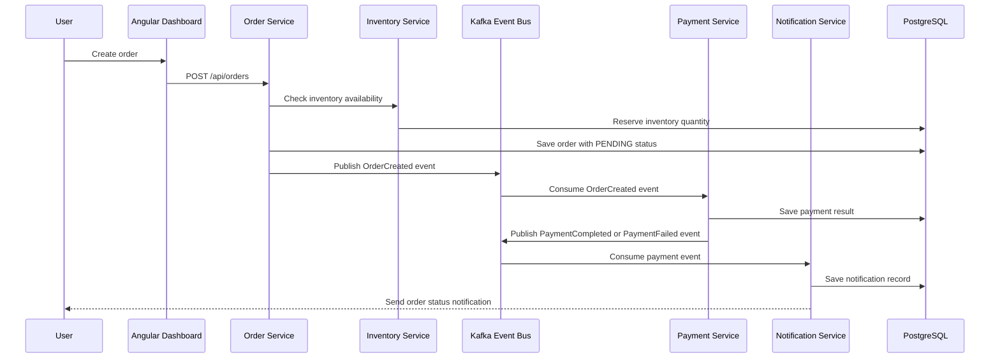

# Smart Supply Chain Order Management Platform

An enterprise-style full-stack portfolio project built to demonstrate backend architecture, supply chain workflows, REST API design, database integration, event-driven communication, caching, security, containerization, and cloud-native deployment.

---

## Project Summary

The **Smart Supply Chain Order Management Platform** is a supply chain/order management system that manages product catalog, inventory availability, order processing, payment simulation, and notifications.

The goal of this project is to go beyond basic CRUD and build a realistic enterprise-style application using technologies commonly used in backend, full-stack, and system design interviews.

---

## Tech Stack

| Layer | Technology |
|---|---|
| Backend | Java 21, Spring Boot |
| API Documentation | Swagger / OpenAPI |
| Database | PostgreSQL |
| ORM | Spring Data JPA / Hibernate |
| Messaging | Kafka |
| Cache | Redis |
| Security | Spring Security, JWT |
| Frontend | Angular |
| Build Tool | Maven |
| Containerization | Docker |
| Orchestration | Kubernetes |
| CI/CD | GitHub Actions |
| Version Control | Git, GitHub |

---

## Target Architecture

```mermaid
flowchart TD

    User[User / Admin] --> UI[Angular Admin Dashboard]

    UI --> API[Spring Boot Backend API]

    API --> Auth[Auth Module]
    API --> Product[Product Module]
    API --> Inventory[Inventory Module]
    API --> Order[Order Module]
    API --> Payment[Payment Module]
    API --> Notification[Notification Module]

    Product --> DB[(PostgreSQL Database)]
    Inventory --> DB
    Order --> DB
    Payment --> DB
    Notification --> DB

    Product --> Cache[(Redis Cache)]
    Inventory --> Cache

    Order --> Kafka[Kafka Event Bus]
    Kafka --> Payment
    Kafka --> Inventory
    Kafka --> Notification

    API --> Swagger[Swagger / OpenAPI]

    GitHub[GitHub Repository] --> Actions[GitHub Actions CI/CD]
    Actions --> Docker[Docker Images]
    Docker --> Kubernetes[Kubernetes Deployment]
```



---

## Application Workflow


---

## How to Run Locally

### 1. Clone the repository

```bash
git clone https://github.com/sowmyajenniefer/smart-supply-chain-platform.git
cd smart-supply-chain-platform
```

### 2. Start PostgreSQL using Docker

If the PostgreSQL container already exists:

```bash
docker start supplychain-postgres
```

If the container does not exist yet:

```bash
docker run --name supplychain-postgres \
  -e POSTGRES_DB=supplychain_db \
  -e POSTGRES_USER=supplychain_user \
  -e POSTGRES_PASSWORD=supplychain_pass \
  -p 5432:5432 \
  -d postgres:16
```

### 3. Run the Spring Boot application

```bash
cd backend/smart-supply-chain
./mvnw spring-boot:run
```

### 4. Test the health API

```http
GET http://localhost:8080/api/health
```

Expected response:

```text
Smart Supply Chain Backend is running successfully
```

---

## Swagger / OpenAPI

After Swagger is configured, API documentation will be available at:

```text
http://localhost:8080/swagger-ui.html
```

OpenAPI JSON will be available at:

```text
http://localhost:8080/v3/api-docs
```

---

## Git Workflow

This project follows a professional Git workflow:

```text
feature branch → pull request → review/checks → merge to main
```

The `main` branch is protected to avoid direct commits.

Example:

```bash
git checkout main
git pull origin main
git checkout -b feature/product-api
```

After changes:

```bash
git add .
git commit -m "Add product API"
git push -u origin feature/product-api
```

Then create a pull request into `main`.
---
